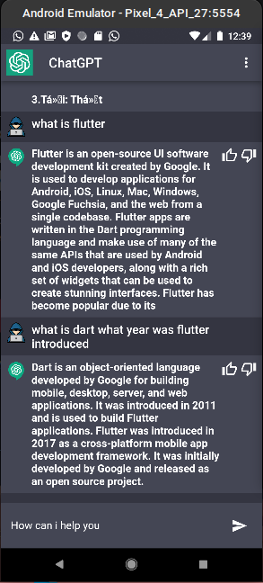

# chat_gpt

A new Flutter project.

## App Screenshot
   

### Features
- can interact with you
- remembers previous chat with the help of the API
- allows you copy and paste text
## New Features Coming Soon!!!
- reduce spamming
- improve accuracy 
- authentication 

## Getting Started

This project is a starting point for a Flutter application.

A few resources to get you started if this is your first Flutter project:

- [Lab: Write your first Flutter app](https://docs.flutter.dev/get-started/codelab)
- [Cookbook: Useful Flutter samples](https://docs.flutter.dev/cookbook)

For help getting started with Flutter development, view the
[online documentation](https://docs.flutter.dev/), which offers tutorials,
samples, guidance on mobile development, and a full API reference.
